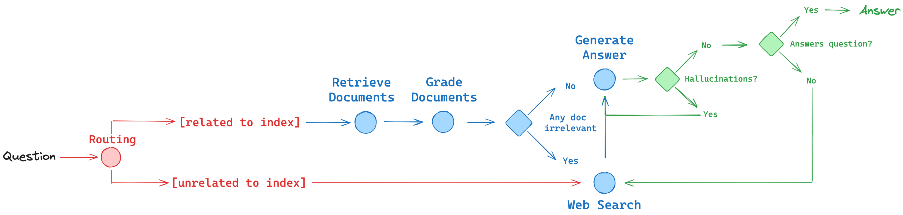
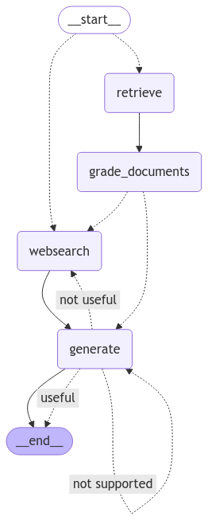

# Advanced RAG control flow with LangGraph

### Implementation of Reflective RAG, Self-RAG & Adaptive RAG

## Features
- Uses: langchain, langgraph, langsmith, tavily, chroma ...
- Self-rag: (used to determine hallucinations, and whether user answer should be returned)
  1. reflect on if answer the model generated is grounded in the documents (hallucinate)
  2. reflect if answer answers the question the user asked
- Adaptive rag: (router)
  1. route question to different rag flows

